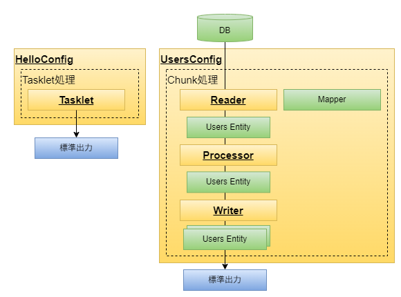

# spring-boot3-batch-try

Spring-Bootでバッチアプリケーション開発

## やりたいこと
* Spring-Bootを使った効率的な開発を行い、ワンコマンドでバッチアプリケーションを実行する
* JAVAだけがインストールされたマシンで、バッチアプリケーションを実行する
* ORマッパーは`MyBatis`を使う
* setter,getterは実装せず、`lombok`で生成する
* アプリケーション開発は、`Spring Initializr`からデモアプリケーションをダウンロードして始める
* `Maven`を使ったライブラリ管理（自動でjarをダウンロードして、クラスパスを通してくれる）

> [!TIP]
> 【Java】Lombokで冗長コードを削減しよう  
> https://www.casleyconsulting.co.jp/blog/engineer/107/ 

## Spring-Bootとは

- 設定ファイルレス  
  Spring-WEB-MVCに対して、あらかじめ様々な設定が設定済みとなっているため、自分で設定ファイルを書く量が少ない

- 簡単起動  
  組み込みH2データベースを使用するため、データベースのインストールが不要

- 素早く開始  
  `Spring Initializr`を使って必要なライブラリが組み込まれた初期構成のアプリケーションをダウンロードできる

- 短所としては、ライフサイクルが比較的短い  
  https://spring.pleiades.io/projects/spring-boot#support

## 前提環境

以下がインストール済みであること
* JDK 17
* git

## 使用するフレームワーク

* spring-boot3.4
* spring-boot-starter-batch
* mybatis
* lombok
* 組み込みh2データベース
* 組み込みMaven 3

> [!TIP]
> Java環境構築(Windows版)　JDKインストール  
> https://www.techfun.co.jp/services/magazine/java/windows-jdk-install.html  
> 
> Java環境構築(Windows版)　パスの設定  
> https://www.techfun.co.jp/services/magazine/java/windows-jdk-pathset.html  
> 
> Git Bashって使ってる？Windowsで動く意外にすごい便利ツール  
> https://www.sejuku.net/blog/72673  


## ディレクトリ階層

```
C:.
│  .gitattributes
│  .gitignore
|  app.drawio
|  app.png
│  initializr.png
│  mvnw
│  mvnw.cmd
│  pom.xml
│  README.md
├─.mvn
│  └─wrapper
│          maven-wrapper.properties
├─h2db
│      .gitkeep
│      h2-2.3.232.jar
│      testdb.mv.db    ※生成される
│      testdb.trace.db ※生成される
├─src
│  ├─main
│  │  ├─java
│  │  │  └─com
│  │  │      └─example
│  │  │          └─demo
│  │  │              │  DemoApplication.java
│  │  │              ├─batch
│  │  │              │  └─master
│  │  │              │      └─user
│  │  │              │          ├─chunk
│  │  │              │          │      UsersConfig.java
│  │  │              │          │      UsersProcessor.java
│  │  │              │          │      UsersWriter.java
│  │  │              │          └─tasklet
│  │  │              │                 HelloConfig.java
│  │  │              └─common
│  │  │                  ├─entity
│  │  │                  │      Users.java
│  │  │                  └─mapper
│  │  │                         UsersMapper.java
│  │  └─resources
│  │          application.properties
│  │          data-all.sql
│  │          schema-all.sql
```

## アプリケーションの構造
- Tasklet処理
  - HelloConfig : "hello world!"と標準出力する
- Chunk処理
  - UsersConfig : Usersテーブルをデータ取得
  - UsersProcessor : 特に処理無し
  - UsersWriter : 取得したデータを標準出力



### タスクレットとは
- 単発の処理
  - テーブルデータのクリア（trancate table）
  - デーブル間でデータ移動（insert into select）
  - シーケンス番号の初期化

### チャンクとは
- 複数レコードの加工・編集処理
  - 1レコードずつ、データ編集、加工
  - チェックして結果がエラーであるレコードは、後続処理を行わず除外する

## 準備 githubからソースコードを取得
gitを使ってソースコードをダウンロードする
```
コマンドプロンプトで実行
git clone https://github.com/namickey/spring-boot3-batch-try.git
cd spring-boot3-batch-try
```

## 実行 spring-boot:run
実行する
```shell
タスクレットを、コマンドプロンプトで実行
mvnw.cmd spring-boot:run -Dspring-boot.run.arguments="--spring.batch.job.name=helloJob"

出力結果
************ hello world! ************
```

```shell
チャンクを、コマンドプロンプトで実行
mvnw.cmd spring-boot:run -Dspring-boot.run.arguments="--spring.batch.job.name=usersJob"

出力結果
********* start ************
Users(id=1, name=鈴木, department=営業, createdAt=2025-04-06)
Users(id=2, name=田中, department=サービス, createdAt=2025-04-06)
********* end **************
```

## application.properties

- データベース初期化用DDL実行モード設定  
  `spring.sql.init.mode=always`
  - ALWAYS：常に初期化してからジョブ実行する。`schema-all.sql`、`data-all.sql`が実行される
    - 複数ジョブを順番に動かす場合には、データが初期化されてしまうため、引継ぎができない。
  - EMBEDDED：組み込みDBの場合のみ初期化する。`schema-all.sql`、`data-all.sql`が実行される
  - NEVER：初期化は行わなず、何もしない。

- SpringBatchの実行履歴などを管理するメタデータテーブルの初期化設定  
  `spring.batch.jdbc.initialize-schema=always`
  - ALWAYS：常に初期化してからジョブ実行する。
  - NEVER：初期化は行わなず、何もしない。

## やってみよう 

### 1. `Spring Initializr`から初期構成のアプリケーションをダウンロードする  
https://start.spring.io/


### 2. 統合開発環境を使って、今動かしたソースコードと同じものを実装し、動作確認する
> [!TIP]
> 統合開発環境（vscode、eclipse、intelliJ）を使おう  
>   * vscode：おススメ、最新、軽量  
>   * eclipse：古き重き友人  
>   * intelliJ：おススメだが、WEB開発時の`spring-boot-devtools`の自動デプロイ機能と相性が悪い。intelliJは入力する度にファイル保存されてしまうから。  

### 3. 自分のgithubアカウントを作って、作ったソースを公開しよう

